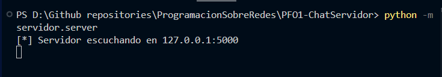
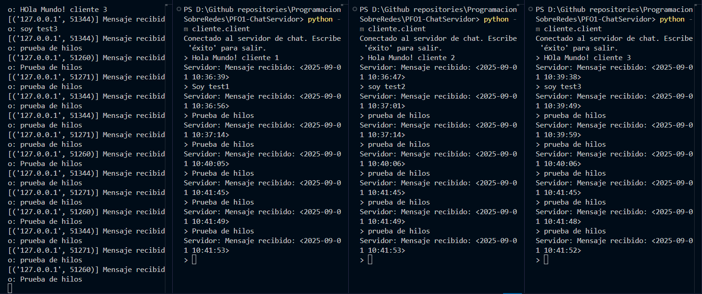
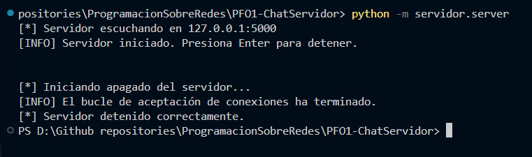
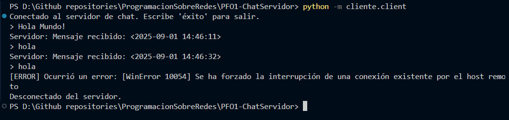
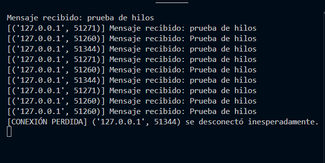
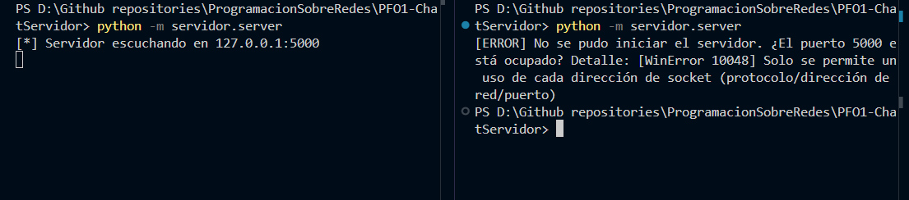
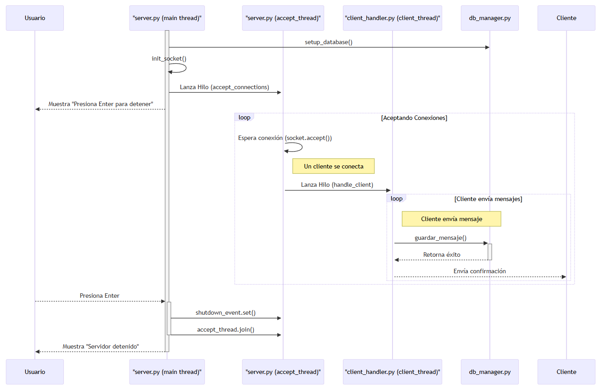
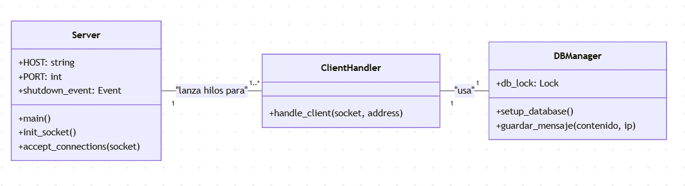
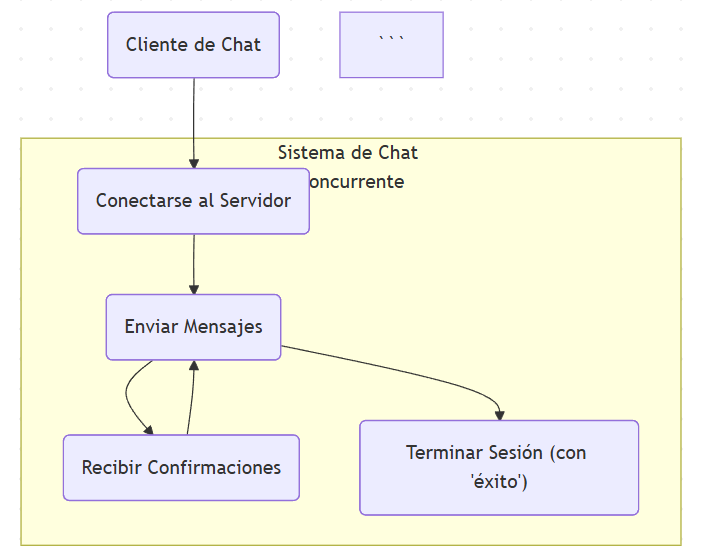

# PFO 1: Chat Básico Cliente-Servidor Concurrente

## Descripción del Proyecto

Esta carpeta contiene la solución a la **Primera Práctica Formativa Obligatoria (PFO 1)** de la materia "Programación sobre Redes".

El proyecto implementa un sistema de chat cliente-servidor en Python, destacando por su arquitectura modular y su capacidad para manejar múltiples clientes de forma concurrente. Los mensajes son persistidos en una base de datos SQLite de manera segura para hilos (`thread-safe`).

Este documento no solo describe el producto final, sino también el **proceso iterativo de pruebas y refactorización** que llevó a la versión actual, más robusta y profesional.

## Características Principales

-   **Servidor Concurrente (`Multi-threaded`):** Capaz de manejar múltiples conexiones simultáneas, asignando un hilo de ejecución por cliente.
-   **Persistencia Segura:** Uso de `threading.Lock` para proteger las escrituras en la base de datos SQLite y prevenir `race conditions`.
-   **Arquitectura Modular:** Código organizado en paquetes (`servidor`, `cliente`) con responsabilidades claras.
-   **Cierre Limpio (`Clean Shutdown`):** El servidor implementa un mecanismo de apagado controlado que no depende de interrupciones de teclado (`Ctrl+C`), asegurando una finalización limpia.
-   **Manejo de Errores Robusto:** El sistema gestiona activamente errores comunes como puertos ocupados, desconexiones abruptas y fallos de conexión.

---

## Estructura del Proyecto

```
PFO1-ChatServidor/
├── assets/
├── cliente/
│   ├── __init__.py
│   └── client.py           # Script principal del cliente
├── servidor/
│   ├── __init__.py
│   ├── db_manager.py       # Módulo de gestión de la base de datos
│   ├── client_handler.py   # Módulo que maneja la lógica de cada cliente
│   └── server.py           # Script principal del servidor
└── chat.db                 # Archivo de la base de datos SQLite
└── README.md               # Esta documentación
```

---

## Stack Tecnológico

-   **Lenguaje:** Python 3.13.5
-   **Librerías Estándar:** `threading`, `socket`, `sqlite3`, `datetime`

---

## Instrucciones de Uso y Pruebas

Para ejecutar y probar el sistema, abre múltiples terminales en la raíz de esta carpeta (`PFO1-ChatServidor/`).

### 1. Iniciar el Servidor

En la **Terminal 1**, ejecuta:
```bash
python -m servidor.server
```

#### Resultado Esperado:
```bash
[*] Servidor escuchando en 127.0.0.1:5000
[INFO] Servidor iniciado. Presiona Enter para detener.
```



### 2. Iniciar Clientes y Probar Concurrencia

En terminales separadas, inicia múltiples clientes:
```bash
python -m cliente.client
```

Puedes enviar mensajes desde todos los clientes simultáneamente. El servidor los procesará de forma concurrente.


### 3. Detener el Servidor

Vuelve a la terminal del servidor y presiona la tecla Enter.

#### Resultado Esperado:
```bash
[*] Iniciando apagado del servidor...
[INFO] El bucle de aceptación de conexiones ha terminado.
[*] Servidor detenido correctamente.
```


---
## Proceso de Desarrollo y Refactorización (Lecciones Aprendidas)

El desarrollo de este proyecto siguió un ciclo de Prueba -> Detección -> Refactorización. A continuación se documentan los casos de prueba clave y las mejoras implementadas.

### Pruebas Iniciales y Detección de Anomalías

Se realizaron una serie de pruebas sobre la versión inicial del servidor para validar su robustez:

- Caso de Prueba A (Servidor Apagado): Se verificó que el cliente maneja correctamente la ConnectionRefusedError al intentar conectarse a un servidor no disponible.



- Caso de Prueba B (Cierre Abrupto): Se probó la resiliencia del servidor al cerrar un cliente de forma forzada. El servidor detectó la ConnectionResetError y continuó operando sin crashear.



- Caso de Prueba C (Puerto Ocupado): Se intentó iniciar una segunda instancia del servidor. Se detectó una anomalía donde SO_REUSEADDR permitía que ambos servidores se iniciaran.
    - Lección: Se aprendió el comportamiento específico de SO_REUSEADDR en ciertos SOs y la necesidad de desactivarlo para este tipo de prueba.



### Refactorización del Mecanismo de Cierre

La prueba inicial de cierre con Ctrl+C (KeyboardInterrupt) demostró ser poco fiable en el entorno de la terminal integrada. Esto llevó a una refactorización crítica del server.py:

1. Problema: El hilo principal estaba bloqueado en server_socket.accept(), impidiendo un mecanismo de cierre limpio.
2. Solución: Se desacopló la lógica de aceptación de conexiones a un hilo dedicado (accept_thread).
3. Mecanismo: El hilo principal ahora queda libre para esperar un input() del usuario. Al presionar Enter, se activa un threading.Event (shutdown_event) que le indica al accept_thread que debe salir de su bucle y cerrar el socket, garantizando un apagado limpio y determinista.

Este proceso de refactorización no solo solucionó un problema técnico, sino que elevó la arquitectura del servidor a un estándar más profesional y robusto.

---
## Diagramas de Arquitectura

### Diagrama de Secuencia



### Diagrama de Clases



### Diagrama Entidad-Relación



---
## Conceptos Clave Implementados

-   **Networking:** Creación y gestión de `sockets` TCP/IP.
-   **Concurrencia:** Modelo `multi-threaded` para el manejo de clientes.
-   **Sincronización:** Protección de recursos compartidos (la base de datos) con threading.Lock.
-   **Persistencia:** Interacción con una base de datos relacional (SQLite) de forma segura (`thread-safe`).
-   **Ingeniería de Software:** Modularización del código, manejo de excepciones y documentación.