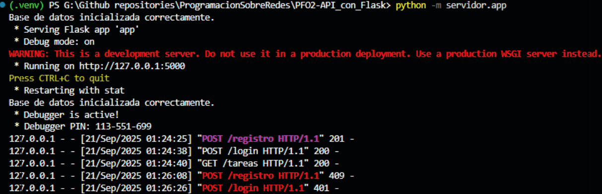
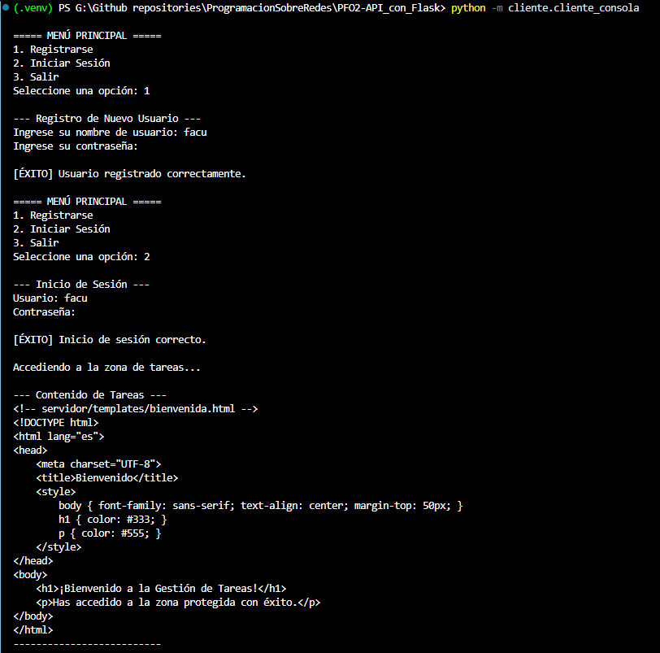
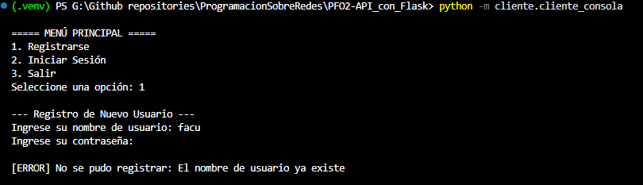
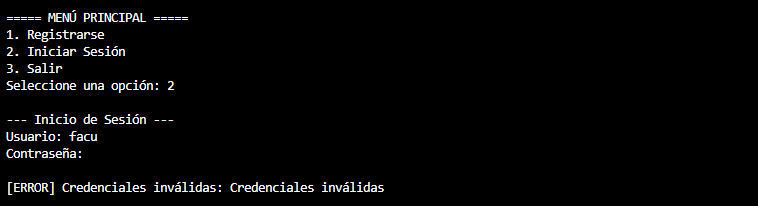

# PFO 2: Sistema de Gestión de Tareas con API y Base de Datos

## Descripción del Proyecto

Este repositorio contiene la solución a la **Segunda Práctica Formativa Obligatoria** de la materia "Programación sobre Redes".

El proyecto consiste en la implementación de una **API RESTful** utilizando el microframework **Flask** y una base de datos **SQLite**. El sistema provee `endpoints` para el registro y la autenticación de usuarios, asegurando las contraseñas mediante `hashing`. Adicionalmente, se desarrolló un **cliente de consola** interactivo en Python para consumir dicha API.

El objetivo de la práctica es demostrar la capacidad de construir una aplicación cliente-servidor completa, gestionar datos persistentes y aplicar prácticas de seguridad fundamentales.

## Características Técnicas

-   **Backend:** API REST construida con **Flask**.
-   **Endpoints Implementados:**
    -   `POST /registro`: Para la creación de nuevos usuarios.
    -   `POST /login`: Para la verificación de credenciales.
    -   `GET /tareas`: Un `endpoint` de ejemplo para usuarios autenticados.
-   **Base de Datos:** **SQLite 3**, gestionada a través del módulo `sqlite3` de Python.
-   **Seguridad:** Las contraseñas de los usuarios se almacenan utilizando `hashing` con el método `pbkdf2:sha256`, implementado a través de la librería **Werkzeug**.
-   **Arquitectura:** Código modular con separación de responsabilidades (API, autenticación, gestión de base de datos).
-   **Cliente:** Aplicación de consola interactiva que utiliza la librería **requests** para la comunicación HTTP con el servidor.
-   **Entorno:** El proyecto está configurado para ejecutarse en un **entorno virtual de Python (`venv`)** para un manejo de dependencias limpio y reproducible.

---

## Estructura del Proyecto
```txt
PFO2-API_con_Flask/
├── assets/ # Carpeta para screenshots de las pruebas
├── cliente/
│ └── cliente_consola.py
├── servidor/
│ ├── app.py
│ ├── auth.py
│ ├── database.py
│ └── templates/
│    └── bienvenida.html
├── .venv/ # Carpeta del entorno virtual (ignorada por Git)
└── README.md
```

---

## Setup y Ejecución

### 1. Configuración del Entorno

**a) Clonar el Repositorio y Navegar al Directorio:**
```bash
git clone https://github.com/facu041294/ProgramacionSobreRedes
cd PFO2-API_con_Flask
```
**b) Crear y Activar el Entorno Virtual:**
```bash
# Crear el entorno
python -m venv .venv
# Activar (en Git Bash)
source .venv/Scripts/activate
# Activar (en Powershell)
.venv/Scripts/Activate.ps1
```
**c) Instalar Dependencias:**
Con el entorno activado, instalar las librerías necesarias:
```bash
pip install Flask Werkzeug requests
```

## 2. Ejecución del Sistema
Se requieren dos terminales con el entorno virtual activado.

a) Iniciar el Servidor:
En la Terminal 1, ejecuta:
```bash
python -m servidor.app
```

(Comentario: Captura de la terminal del servidor mostrando el mensaje * Running on http://127.0.0.1:5000)

b) Iniciar el Cliente:
En la Terminal 2, ejecuta:
```bash
python -m cliente.cliente_consola
```

## Pruebas de Funcionamiento y Evidencia

1. Flujo de Registro y Login Exitoso (Happy Path)
Se probó el registro de un nuevo usuario y su posterior inicio de sesión, culminando en el acceso exitoso al endpoint /tareas.


(Comentario: Captura de la terminal del cliente mostrando el menú, un registro exitoso, un login exitoso y la posterior impresión del HTML de bienvenida.)

2. Pruebas de Casos de Error
Se validó el manejo de errores comunes para asegurar la robustez del sistema.

a) Intento de Registro de Usuario Duplicado:


(Comentario: Captura de la terminal del cliente mostrando el mensaje de error No se pudo registrar: El nombre de usuario ya existe.)

b) Intento de Login con Credenciales Inválidas:


(Comentario: Captura de la terminal del cliente mostrando el mensaje de error Credenciales inválidas.)

c) Intento de Conexión con Servidor Apagado:


(Comentario: Captura de la terminal del cliente mostrando el mensaje de error No se pudo conectar con el servidor. ¿Está corriendo?.)

---

## Respuestas Conceptuales

1. ¿Por qué hashear contraseñas?
El hashing de contraseñas es una práctica de seguridad fundamental e innegociable. Su propósito es nunca almacenar las contraseñas de los usuarios en texto plano. Si la base de datos fuera comprometida, los atacantes no obtendrían las contraseñas reales, sino una serie de hashes criptográficos. Un hash es un proceso de un solo sentido: es computacionalmente inviable revertirlo para obtener la contraseña original. Al verificar un login, no se compara contraseña con contraseña, sino que se hashea la contraseña ingresada y se compara el hash resultante con el hash almacenado.

2. Ventajas de usar SQLite en este proyecto.
Para este proyecto, SQLite presenta varias ventajas clave:
Serverless y Basado en Archivos: No requiere un proceso de servidor de base de datos separado, lo que simplifica enormemente la configuración y el despliegue. La base de datos es un único archivo (tareas.db) en el proyecto.
Cero Configuración: Es extremadamente fácil de empezar a usar, ya que el módulo sqlite3 viene incluido en la biblioteca estándar de Python.
Portabilidad: Al ser un solo archivo, la base de datos completa es fácilmente portable, copiable y backupeable.
Ideal para Prototipado y Aplicaciones Pequeñas: Es la elección perfecta para proyectos de pequeña a mediana escala, desarrollo y pruebas, donde la complejidad de un servidor de base de datos completo como PostgreSQL o MySQL sería un overkill.

3. ¿Por qué usar pbkdf2 con sha256 para encriptar?
La idea detrás de PBKDF2 es prevenir los ataques de "rainbow table". El objetivo es hacer que, incluso si la base de datos de usuarios se filtrara, sea casi imposible comprometer la cuenta de un usuario.
Si hoy en dia, se recomienda aparte de usar este metodo, es agregar rondas extras para que sea mas caro ejecutar ataques, sumando tambien una sal única golbal para que no se pueda importar una "rainbow table" en la BD y por último agregar una "pepper", que seria una pieza guardada en otro lugar para poder acceder a los datos.