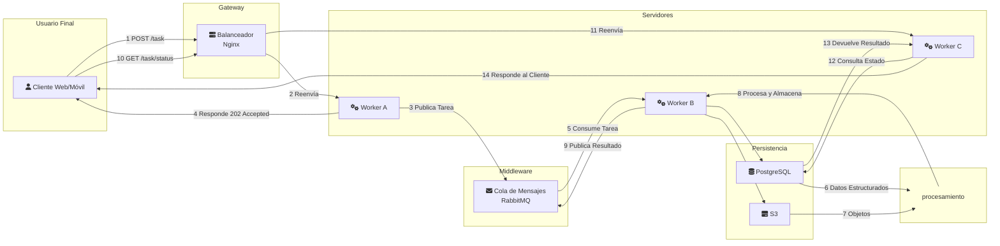

# PFO 3: Sistema Distribuido con Sockets en Python

Aqui tenemos la implementación en Python para la Práctica Formativa Obligatoria N°3 de la materia Programación sobre Redes. El objetivo es simular una arquitectura de sistema distribuido Cliente-Servidor para el procesamiento de tareas de forma asíncrona.

## Arquitectura del Sistema

El sistema se compone de tres componentes principales que se comunican a través de sockets TCP utilizando el módulo `asyncio` de Python para operaciones de I/O no bloqueantes:

1.  **`server.py` (Dispatcher):**
    *   Actúa como el cerebro central del sistema.
    *   Escucha conexiones entrantes en el puerto `8888`.
    *   Mantiene un registro de los `workers` que se conectan y están disponibles.
    *   Recibe tareas de los `clients`, las encola y las distribuye a los `workers` disponibles.
    *   Gestiona el flujo de resultados desde los `workers` de vuelta a los `clients` correspondientes.

2.  **`worker.py` (Procesador de Tareas):**
    *   Simula una unidad de procesamiento.
    *   Al iniciarse, se conecta al `server.py` y se registra para recibir trabajo.
    *   Entra en un bucle de espera, listo para aceptar tareas.
    *   Al recibir una tarea, simula un tiempo de procesamiento y devuelve el resultado al servidor.
    *   Se pueden ejecutar múltiples instancias de `worker.py` para simular un `pool` de procesamiento.

3.  **`client.py` (Emisor de Tareas):**
    *   Simula un usuario o servicio que necesita que se realice un trabajo.
    *   Se conecta al `server.py` y envía una o más tareas para su procesamiento.
    *   Espera de forma asíncrona las respuestas (confirmaciones y resultados finales) del servidor.

### Diagrama de Arquitectura

El siguiente diagrama ilustra el flujo de comunicación entre los componentes implementados:




## Protocolo de Comunicación

La comunicación entre los nodos se realiza a través de mensajes en formato **JSON**, enviados como `bytes` a través de los sockets. Cada mensaje contiene un campo `"type"` que define su propósito:

*   `{"type": "register", "role": "worker", "id": "..."}`: Enviado por un `worker` para registrarse.
*   `{"type": "task", "payload": "..."}`: Enviado por un `client` para solicitar un trabajo.
*   `{"type": "ack", "task_id": "...", "status": "recibida"}`: Enviado por el `server` al `client` para confirmar la recepción de una tarea.
*   `{"type": "result", "task_id": "...", "result": "..."}`: Enviado por un `worker` (a través del `server`) con el resultado de una tarea.

## Instrucciones de Ejecución

Para probar el sistema, necesitarás abrir al menos 3 terminales.

1.  **Terminal 1: Iniciar el Servidor**
    ```bash
    python server.py
    ```
    El servidor comenzará a escuchar conexiones.

2.  **Terminal 2 (y opcionales): Iniciar uno o más Workers**
    ```bash
    python worker.py
    ```
    Verás en el log del servidor que el `worker` se ha registrado.

3.  **Terminal 3: Iniciar el Cliente**
    ```bash
    python client.py
    ```
    El cliente se conectará, enviará una serie de tareas y esperará los resultados. Observa cómo el servidor distribuye el trabajo y cómo los resultados llegan de vuelta al cliente.
